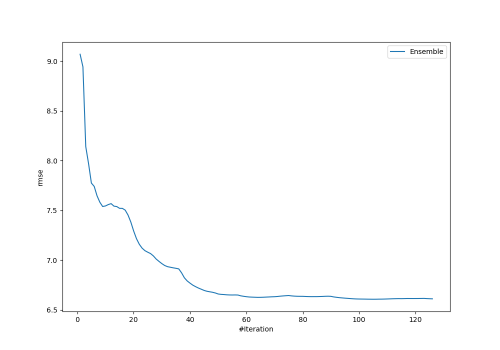
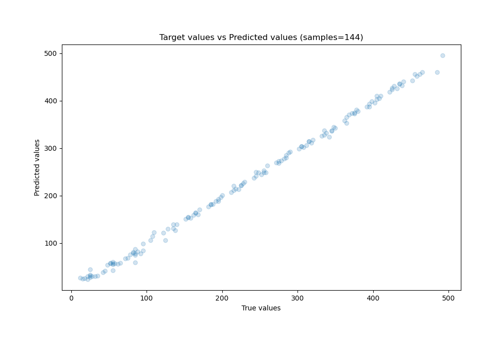
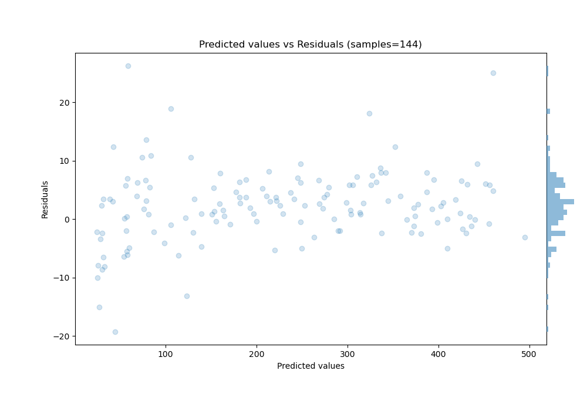

# Summary of Ensemble

[<< Go back](../README.md)

## Ensemble structure
| Model                             |   Weight |
|:----------------------------------|---------:|
| 101_Xgboost                       |        1 |
| 103_Xgboost                       |        2 |
| 109_ExtraTrees                    |        7 |
| 2_DecisionTree                    |        6 |
| 37_CatBoost                       |        1 |
| 3_DecisionTree_GoldenFeatures     |        7 |
| 47_RandomForest_SelectedFeatures  |        5 |
| 58_NeuralNetwork_SelectedFeatures |        3 |
| 63_NeuralNetwork                  |        1 |
| 80_CatBoost_SelectedFeatures      |       10 |
| 82_RandomForest_SelectedFeatures  |        9 |
| 8_Default_NeuralNetwork           |        2 |
| 95_NeuralNetwork_SelectedFeatures |        1 |
| 96_NeuralNetwork_SelectedFeatures |        2 |
| 99_Xgboost_SelectedFeatures       |       48 |

### Metric details:
| Metric   |      Score |
|:---------|-----------:|
| MAE      |  4.83738   |
| MSE      | 43.6454    |
| RMSE     |  6.60647   |
| R2       |  0.9977    |
| MAPE     |  0.0599137 |

## Learning curves

## True vs Predicted

## Predicted vs Residuals

[<< Go back](../README.md)
